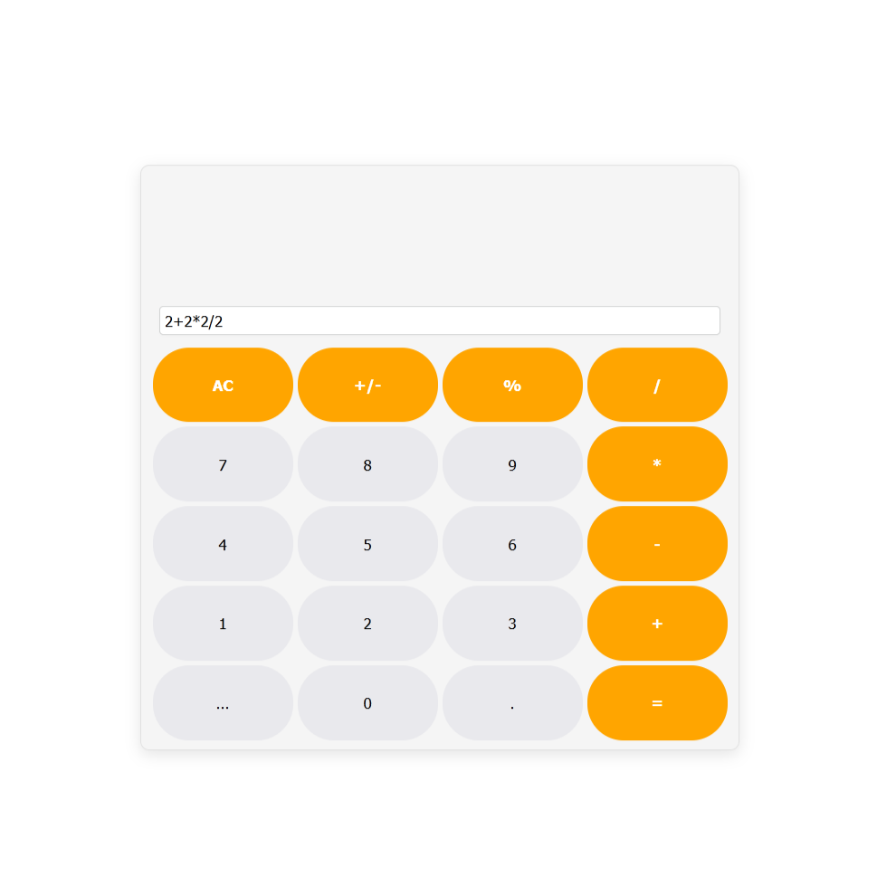

# Basic Calculator
🧮 This calculator involves me practicing into JS + HTML. 

Application provides minimalistic design with calculations memory feature.

---

### The app features:
- Calculations history with expressions (up to 3)
- Using of `math.js` library
- Neat design

---

### 📃 To-do:
- Adding brackets to last number entered like Apple does. 
  - Example: `100-10` -> *press* `+/-` -> `100-(-10)`
- Small button near input field to remove 1 symbol

---

### ✅ Done:
- Fixed scenarios when user entered something like `6+` and pressed `=` and it got written into the expressions memory list

# Screenshots

